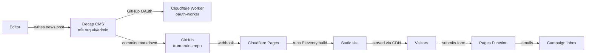

<div align="center">


# Tram Trains for Edinburgh

**Bringing passenger trains back to Edinburgh's South Suburban Railway.**

[](https://ttfe.org.uk)
[](https://www.11ty.dev/)
[](https://pages.cloudflare.com/)
[](LICENSE)

<br>


</div>

---

## About the campaign

**[Tram Trains for Edinburgh](https://ttfe.org.uk)** (TTfE) is a volunteer campaign calling for the restoration of passenger services on the Edinburgh South Suburban Railway, using modern **tram-train** technology that can run on both street-tram tracks and the national rail network.

We want to connect communities that the current tram line doesn't reach &mdash; **Newington, Morningside, Craiglockhart, Portobello, Brunstane** &mdash; to Haymarket, Murrayfield, and the city centre, making use of an existing railway that already loops around the south of the city.

This repository holds the code and content for the campaign's website, its authoring tools, and a developing interactive route map.

---

## What's in this repo

This is a small monorepo containing everything the campaign needs to run its online presence.

| Directory | Purpose |
|---|---|
| **[pf-site/](pf-site/)** | The public campaign website at [ttfe.org.uk](https://ttfe.org.uk). Static site built with [Eleventy](https://www.11ty.dev/), content edited through [Decap CMS](https://decapcms.org/). Deployed via Cloudflare Pages. |
| **[oauth-worker/](oauth-worker/)** | A small Cloudflare Worker that authenticates CMS editors against GitHub. Without this, Decap CMS can't commit changes back to the repository. |
| **[map/](map/)** | Interactive map of Edinburgh's historic and current rail infrastructure, used to visualise the proposed route. |
| **[docs/](docs/)** | Internal briefing notes for the TTfE committee. |

---

## How it works



- Content lives as **Markdown files** in this repo. No database.
- Every push to `main` triggers Cloudflare Pages to rebuild and publish.
- News editors use a browser-based CMS; their changes become commits authored by their GitHub account.
- Contact and membership forms are handled by tiny Cloudflare Pages Functions that verify a Cloudflare Turnstile token and email submissions via [Resend](https://resend.com).

---

## Technology choices

| Layer | Choice | Why |
|---|---|---|
| **Static site generator** | Eleventy | Simple, no framework lock-in, decade-scale longevity. |
| **Templating** | Nunjucks + Markdown | Accessible to anyone comfortable with HTML. |
| **Hosting** | Cloudflare Pages | Free, globally distributed, git-driven deploys. |
| **CMS** | Decap CMS | Open source, commits directly to Git &mdash; full audit trail, no vendor lock-in. |
| **Auth** | GitHub OAuth (via Cloudflare Worker) | No separate user database to manage. |
| **Forms** | Cloudflare Pages Functions + Resend | Server-side Turnstile verification, reliable email delivery, free at campaign scale. |
| **Anti-spam** | Cloudflare Turnstile | Privacy-preserving CAPTCHA alternative. |
| **DNS + CDN** | Cloudflare | Same account as hosting, no extra config. |

**At our traffic levels, the total infrastructure cost is currently zero** &mdash; aside from the domain's annual £10 renewal.

---

## Getting started

### Run the site locally

```bash
git clone https://github.com/Tram-Trains-for-Edinburgh/tram-trains.git
cd tram-trains/pf-site
npm install
npm run serve
```

The site will be at <http://localhost:8080> with auto-reload on save.

Full setup, deployment, and CMS details are in [**pf-site/README.md**](pf-site/README.md).

### Related docs

- [pf-site/README.md](pf-site/README.md) &mdash; full build, deploy, and CMS guide
- [oauth-worker/README.md](oauth-worker/README.md) &mdash; OAuth worker deployment
- [pf-site/CLAUDE.md](pf-site/CLAUDE.md) &mdash; detailed stack and conventions

---

## Contributing

We're a small volunteer campaign and welcome help, but please open an **issue** to discuss any proposed change before opening a pull request &mdash; our priorities on content, language, and design are tightly bound up with campaign strategy.

For typos, broken links, or obvious bug fixes, feel free to open a PR directly.

Content edits (news posts) should usually go through the CMS at <https://ttfe.org.uk/admin/> rather than this repository.

---

## Licence

Code in this repository is released under the [MIT licence](LICENSE).

Campaign content &mdash; page copy, images, maps, and other creative work &mdash; remains the property of Tram Trains for Edinburgh and is shared for reference only. Please contact us before reusing it elsewhere.

---

<div align="center">

**Tram Trains for Edinburgh**<br>
<a href="https://ttfe.org.uk">ttfe.org.uk</a> &middot; <a href="mailto:tramtrainsedi@gmail.com">tramtrainsedi@gmail.com</a>

</div>
